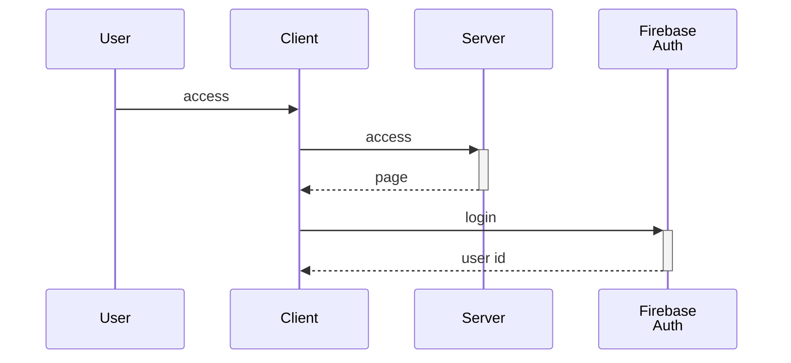
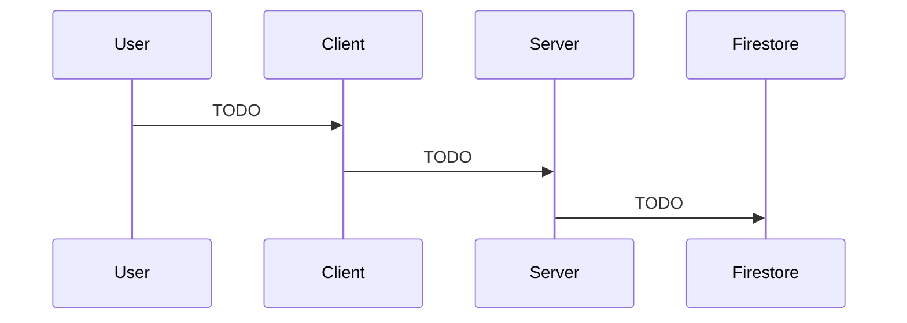
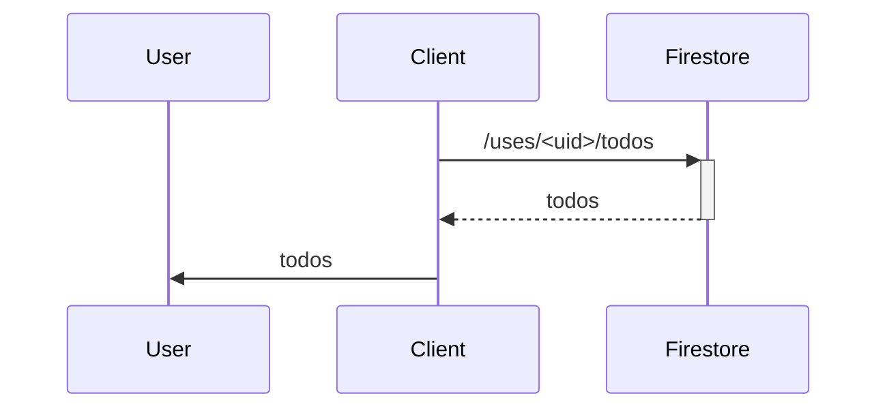

# todo-nextjs

TODO web app of Next.js

## Environments

- React 18
- Next.js App Router 14
- Tailwind CSS
- Firebase Firestore
- Firebase Authentication

## Features

### User Authentication

### Create/Update/Delete TODO

Create/Update/Delete operations use Server Actions and Firebase Admin SDK.

### Select TODO

Select operation uses realtime update of Firestore client SDK.

